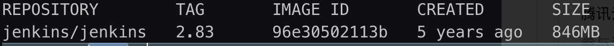

# docker 安装 jenkins

> 首先保证要有 docker 环境

1.docker 下载 jenkins 镜像 指定版本(低版本的后面安装插件会失败)

```bash
docker pull jenkins/jenkins
```

2.查看 jenkines 是否安装成功

```
docker images
```



3.启动 docker

```
docker run -p 8080:8080 -p 50000:50000 jenkins/jenkins
```

<!--  -->

4.启动成功后打开，出现如下页面

http://localhost:8080/


5.查看密码

```
docker logs -f --since "2023-04-03" 容器名称
```

- `-f`:实时滚动显示 log

  6.输入密码进入


7.安装插件


创建管理员用户


实例配置


