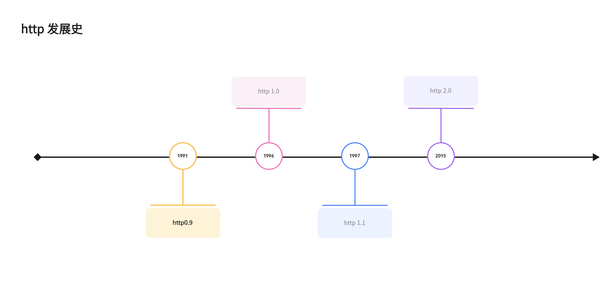

---
nav:
  title: http
order: 0
---

# http 发展史

## http 时间轴



## http 不同版本之间的不同

### http 0.9-单行协议

最初版本的 http 并没有版本号，后来它的版本号被定位在 0.9 以区分后来的版本。

http 0.9 的构成极其简单：请求由单行指令构成，也只有一个 get 方法。

**请求**

- get 开头
- 目标资源路径（一旦连接到服务器，协议、服务器、端口号这些都不是必须的）

```js
GET / mapage.html;
```

**响应**

- 没有状态码
- 响应内容并不包含 HTTP 头
- 只能传输 html 文件

```html
<html>
  这是一个非常简单的 HTML 页面
</html>
```

### http 1.0-构建可扩展性

> 由于 http/0.9 协议应用十分有限，浏览器和服务器迅速扩展内容使其用途更广

- 协议版本信息现在会随每个请求发送（HTTP/1.0 被追加到了 GET 行）

  ```json
  http://example.com/index.html?http10
  ```

- 状态码会在响应开始时发送，使浏览器了解请求执行成功或者失败，并调整响应的行为(如更新或者使用本地缓存)

- 引入 HTTP 标头的概念，无论对于请求还是响应，允许传输元数据，使协议变得灵活，扩展性高

  - Content-Type

- 在 HTTP 标头的帮助下，具备了传输除纯文本 HTML 文件外其它类型的文档的能力

**请求 html**

```html
GET /mypage.html HTTP/1.0 User-Agent: NCSA_Mosaic/2.0 (Windows 3.1) 200 OK Date: Tue, 15 Nov 1994
08:12:31 GMT Server: CERN/3.0 libwww/2.17 Content-Type: text/html
<html>
  一个包含图片的页面
  
</html>
tml
```

**请求图片**

```js
GET /myimage.gif HTTP/1.0
User-Agent: NCSA_Mosaic/2.0 (Windows 3.1)

200 OK
Date: Tue, 15 Nov 1994 08:12:32 GMT
Server: CERN/3.0 libwww/2.17
Content-Type: text/gif
(这里是图片内容)

```

### http 1.1

- 连接可复用，节省了多次打开 TCP 连接加载网页文档资源的时间
- 增加管线化机技术，允许在第一个应答被完全发送之前就发送第二个请求，以降低通信延迟。
- 支持响应分块
- 引入额外的缓存控制机制
- 引入内容协商机制，包括语言、编码、类型等。并允许客户端和服务器之间约定以最合适的内容进行交换。
- 凭借 Host 标头，能够使不同域名配置在同一个 IP 地址的服务器上。

```bash
GET /en-US/docs/Glossary/Simple_header HTTP/1.1
Host: developer.mozilla.org
User-Agent: Mozilla/5.0 (Macintosh; Intel Mac OS X 10.9; rv:50.0) Gecko/20100101 Firefox/50.0
Accept: text/html,application/xhtml+xml,application/xml;q=0.9,*/*;q=0.8
Accept-Language: en-US,en;q=0.5
Accept-Encoding: gzip, deflate, br
Referer: https://developer.mozilla.org/en-US/docs/Glossary/Simple_header

200 OK
Connection: Keep-Alive
Content-Encoding: gzip
Content-Type: text/html; charset=utf-8
Date: Wed, 20 Jul 2016 10:55:30 GMT
Etag: "547fa7e369ef56031dd3bff2ace9fc0832eb251a"
Keep-Alive: timeout=5, max=1000
Last-Modified: Tue, 19 Jul 2016 00:59:33 GMT
Server: Apache
Transfer-Encoding: chunked
Vary: Cookie, Accept-Encoding

(content)


GET /static/img/header-background.png HTTP/1.1
Host: developer.mozilla.org
User-Agent: Mozilla/5.0 (Macintosh; Intel Mac OS X 10.9; rv:50.0) Gecko/20100101 Firefox/50.0
Accept: */*
Accept-Language: en-US,en;q=0.5
Accept-Encoding: gzip, deflate, br
Referer: https://developer.mozilla.org/en-US/docs/Glossary/Simple_header

200 OK
Age: 9578461
Cache-Control: public, max-age=315360000
Connection: keep-alive
Content-Length: 3077
Content-Type: image/png
Date: Thu, 31 Mar 2016 13:34:46 GMT
Last-Modified: Wed, 21 Oct 2015 18:27:50 GMT
Server: Apache

(image content of 3077 bytes)

```

**请求图片**

### http 2.0

- 基于`SPDY`

- Http2.0 是二进制协议而不是文本协议。不再可读，也不可无障碍手动创建，改善的优化技术现在可被实施。
- 是一个多路复用协议。并行的请求能够在同一链接中进行处理，移除了 Http/1.x 中的顺序和阻塞的约束
- 压缩了标头。因为标头在一系列请求中常常是相似的，其移除了重复和传输重复数据的成本
- 允许服务器在客户端缓存中填充数据，通过一个叫服务器推送的机制来提前请求
